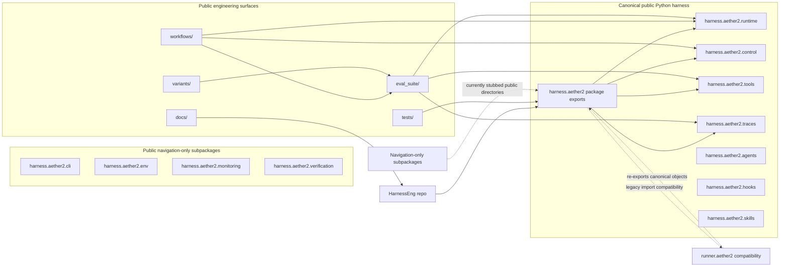

# Public Architecture

HarnessEng is organized around a canonical public Python namespace plus a set
of evaluation and workflow surfaces around it.

## Canonical Layout

## Runtime

`harness.aether2.runtime` contains workspace execution and support plumbing:

- `action_bus.py`
- `azure_openai_env.py`
- `bridge_harbor.py`
- `cleanup_accounting.py`
- `compactor.py`
- `context.py`
- `escalation.py`
- `executor.py`
- `jobs.py`
- `metrics.py`
- `model_client.py`
- `model_response_normalizers.py`
- `model_route_helpers.py`
- `model_routes.py`
- `orientation.py`
- `orientation_helpers.py`
- `prompts.py`
- `route_schemas.py`
- `sessions.py`
- `tpm_pacer.py`
- `verify.py`
- `verify_evidence.py`
- `verify_report.py`

## Control

`harness.aether2.control` contains the loop and orchestration boundary:

- `action_helpers.py`
- `completion.py`
- `execution_context.py`
- `loop.py`
- `pkg_detect.py`
- `reasoning_trace.py`
- `requirements.py`
- `runtime_support.py`
- `tail_helpers.py`
- `tool_dispatch.py`
- `verification_context.py`
- `verification_rounds.py`

## Tools

`harness.aether2.tools` surfaces the canonical tool schema, permissions, and dispatch:

- `mcp.py`
- `native.py`
- `permissions.py`
- `registry.py`

## Traces

`harness.aether2.traces` contains the evidence and decision artifacts:

- `_blocker_builders.py`
- `_blocker_relevance.py`
- `_failure_families.py`
- `_text_utils.py`
- `artifact_command_classify.py`
- `artifact_type_tables.py`
- `blockers.py`
- `decision_trace.py`
- `delta.py`
- `dt_event_extraction.py`
- `dt_observation_summarize.py`
- `dt_receipts.py`
- `dt_row_loading.py`
- `envelope.py`
- `envelope_digest.py`
- `evidence_ledger.py`
- `kernel_artifacts.py`
- `mirror.py`
- `receipts.py`
- `redaction.py`
- `snapshot_diff.py`
- `terminal_claims.py`
- `verifier.py`

## Agents

`harness.aether2.agents` implements the agent model loading and structured task boundaries:

- `agent_types.py`
- `handoff.py`
- `loader.py`
- `runtime.py`
- `task.py`

## Hooks

`harness.aether2.hooks` implements session-scoped lifecycle callbacks:

- `builtins.py`
- `lifecycle.py`
- `registry.py`

## Skills

`harness.aether2.skills` implements reusable agent behavior modules and dynamic registry:

- `frontmatter_helpers.py`
- `invocation.py`
- `loader.py`
- `registry.py`
- `skill_types.py`

## Navigation-Only Subpackages

The following directories are part of the public package map but do not yet
contain separate Python implementations:

- `harness/aether2/cli/`
- `harness/aether2/env/`
- `harness/aether2/monitoring/`
- `harness/aether2/verification/`

## Eval Suite

`eval_suite/` is the public home for task packs, graders, adapters, boards,
fixtures, sentinels, and scoreboards. It is the evaluation layer around the
runtime, not the runtime itself.

The public eval map now has dedicated family, harness, calibration, and
adapted-pressure layers:

- `eval_suite/families/`
- `eval_suite/whole_harness/`
- `eval_suite/calibration_lanes/`
- `eval_suite/benchmark_derived_families/`

The concrete executable smoke packs still live under
`eval_suite/families/filesystem/public_manifest_repair_smoke/` and
`eval_suite/families/runtime_contract/homolog_contract_smoke/`, with matching boards in
`eval_suite/boards/` and example scoreboards in `eval_suite/scoreboards/`.

## Workflows

`workflows/` documents the AI-native engineering system used to build the
harness: governed multi-agent work, analysis, synthesis, evaluation governance,
and publication procedures.

## Variants

`variants/` records mechanism families and shared scoreboards. It is the public
surface for hypothesis tracking, not a production runtime entrypoint.

## Compatibility Boundary

`runner.aether2` stays available for existing imports and tests, but it is not
the canonical ownership boundary. New public references should use
`harness.aether2` first.
